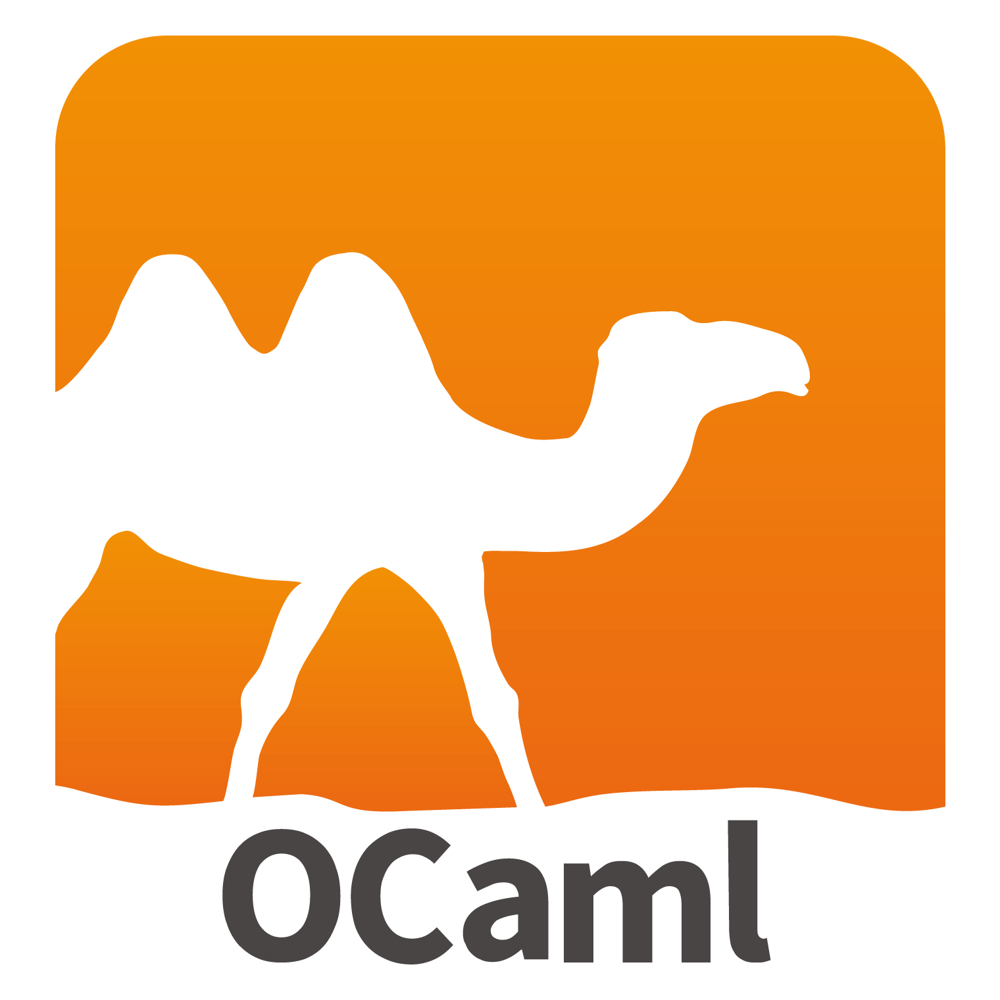
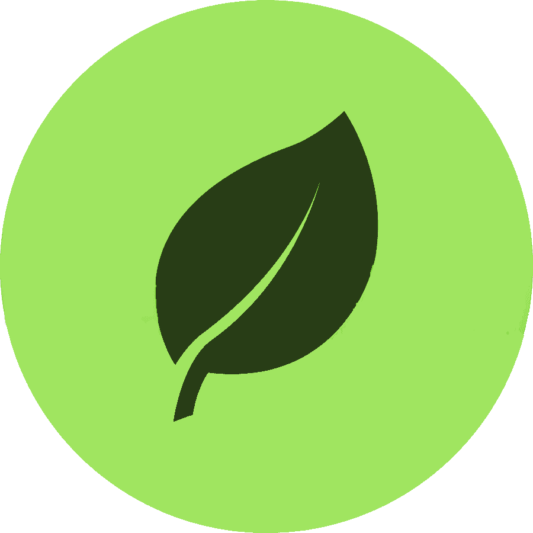

# Hello world! My name is Jakub, and you've entered my github!

- 👋 Hi, I’m @Jakub-Bednarek - Wroclaw University of Science and Technology student
- 👀 Interested in Game Engine Development
- :biohazard: Employed as C++ developer in Nokia Solutions and Networks
- :video_game: Main goal is to become developer of tools used by greatest game making companies!
- 🖨️ Reach me via e-mail: jakub.bednarek1009@gmail.com

<table>
  <tr>
    <td valing="top">
      
    </td>
    <td valing="top">
      
    </td>
  </tr>
 </table>

## Worked with

## Main project
<a href="https://github.com/Jakub-Bednarek/vis"> Visual - game engine</a>

## Finished projects
<a href="https://github.com/Jakub-Bednarek/programmin-paradigms"> Algorithms and data structures</a> 
<a href="https://github.com/Jakub-Bednarek/zbysiu_the_bot"> ZbysiuTheBot - Java discord bot</a> 
<a href="https://github.com/Jakub-Bednarek/DoublyLinkedList"> Doubly linked list</a> 
<a href="https://github.com/Jakub-Bednarek/ECS"> Simple EntityComponentSystem</a> 

## Work in progress
<a href="https://github.com/Jakub-Bednarek/programming_paradigms"> Programming Paradigms</a> 
<a href="https://github.com/Jakub-Bednarek/effective_programming_tech"> Effective programming techinques</a> 
